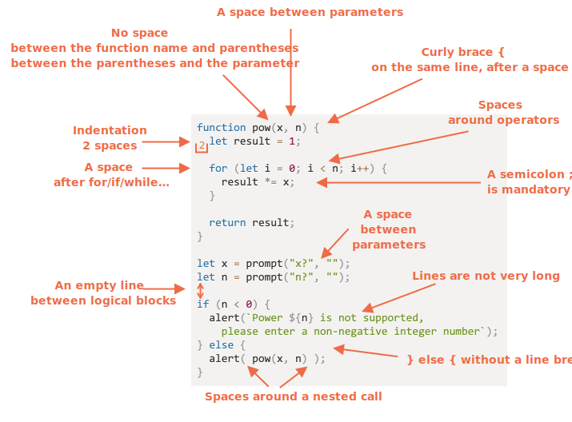

자바스크립트 코드품질

### 목차
[1. Chrome으로 디버깅하기](#1-Chrome으로-디버깅하기)<br>
[2. 코딩 스타일](#2-코딩-스타일)<br>
[3. 주석](#3-주석)<br>
[4. 닌자 코드](#4-닌자-코드)<br>

## 1. Chrome으로 디버깅하기
디버깅(debugging)은 스크립트 내 에러를 검출해 제거하는 일련의 과정을 의미합니다.

### 1.1 ‘Sources’ 패널
- 크롬을 실행하고 개발자도구를 연다. (win: f12, mac : cmd + opt + I)
- Sources 탭을 클릭해 Sources 패널(panel)을 엽니다.

Sources 패널은 크게 세 개의 영역으로 구성됩니다.

1. 리소스 영역 – 페이지를 구성하는 데 쓰인 모든 리소스(HTML, JavaScript, CSS, 이미지 파일 등)를 트리 형태로 보여줍니다. Chrome 익스텐션이 여기 나타날 때도 있습니다.
2. 소스 코드 영역 – 리소스 영역에서 선택한 파일의 소스 코드를 보여줍니다. 여기서 소스 코드를 편집할 수도 있습니다.
3. 디버깅 영역 – 디버깅에 관련된 기능을 제공합니다. 곧 자세히 살펴보겠습니다.

### 1.2 콘솔
Esc를 누르면 개발자 도구 하단부에 콘솔 창이 열립니다. 여기에 명령어를 입력하고 Enter를 누르면 입력한 명령어가 실행됩니다.

콘솔 창에 구문(statement)을 입력하고 실행하면 아랫줄에 실행 결과가 출력됩니다.

1+2를 입력하면 3이 출력됩니다.

### 1.3 중단점
[예시 페이지](https://ko.javascript.info/article/debugging-chrome/debugging/index.html) 내부에서 무슨 일이 일어나는지 자세히 살펴봅시다. hello.js를 소스 코드 영역에 띄우고 네 번째 줄 코드 좌측의 줄 번호, 4를 클릭합시다. 코드가 아닌 줄 번호 4에 마우스 커서를 옮긴 후 클릭해야 합니다.

중단점(breakpoint) 은 말 그대로 자바스크립트의 실행이 중단되는 코드 내 지점을 의미합니다.

Sources 패널 우측의 디버깅 영역을 보면 중단점 목록을 확인할 수 있습니다. 파일 여러 개에 다수의 중단점을 설정해 놓은 경우, 디버깅 영역을 이용하면 아래와 같은 작업을 할 수도 있습니다.

- 항목을 클릭해 해당 중단점이 설정된 곳으로 바로 이동할 수 있습니다,
- 체크 박스 선택을 해제해 해당 중단점을 비활성화 할 수 있습니다.
- 마우스 오른쪽 버튼을 클릭했을 때 나오는 중단점 제거 관련 기능을 중단점을 삭제할 수도 있습니다.
- 이 외에도 다양한 기능이 있습니다.

1.3.1 조건부 중단점 <br>
줄 번호에 커서를 옮긴 후 마우스 오른쪽 버튼을 클릭하면 조건부 중단점(conditional breakpoint) 을 설정할 수 있습니다. Add conditional breakpoint를 클릭했을 때 뜨는 작은 창에 표현식을 입력하면, 표현식이 참인 경우에만 실행을 중지시킬 수 있습니다.

### 1.4 debugger 명렁어
아래 예시처럼 스크립트 내에 debugger 명령어를 적어주면 중단점을 설정한 것과 같은 효과를 봅니다.

```javascript
function hello(name) {
  let phrase = `Hello, ${name}!`;

  debugger;  // <-- 여기서 실행이 멈춥니다.

  say(phrase);
}
```
debugger 명령어를 사용하면 브라우저를 켜 개발자 도구를 열고 소스 코드 영역을 띄워 중단점을 설정하는 수고를 하지 않아도 됩니다. 에디터를 떠나지 않고도 중단점을 설정할 수 있기 때문에 편리하죠.

### 1.5 멈추면 보이는 것들
 중단점을 작동시켜봅시다.

 이 상태에서 디버깅 영역의 ▼를 클릭해 하위 패널들을 하나씩 펼쳐봅시다. 각 패널은 아래와 같은 기능을 제공합니다.

- Watch – 표현식을 평가하고 결과를 보여줍니다.
- Call Stack – 코드를 해당 중단점으로 안내한 실행 경로를 역순으로 표시합니다.
- Scope – 현재 정의된 모든 변수를 출력합니다.

### 1.6 실행 추적하기
디버깅 영역 상단에 있는 버튼들이 무슨 역할을 하는지 알아봅시다.

 - ‘Resume’: 스크립트 실행을 다시 시작함 (단축키 F8)
 - ‘Step’: 다음 명령어를 실행함 (단축키 F9)
 - ‘Step over’: 다음 명령어를 실행하되, 함수 안으로 들어가진 않음 (단축키 F10)
 - ‘Step into’ (단축키 F11) 비동기 동작을 담당하는 코드로 진입하고, 필요하다면 비동기 동작이 완료될 때까지 대기
 - ‘Step out’: 실행 중인 함수의 실행이 끝날 때 까지 실행을 계속함 (단축키 Shift+F11)
 - 모든 중단점을 활성화/비활성화
 - 예외 발생 시 코드를 자동 중지시켜주는 기능을 활성화/비활성화

1.6.1 Continue to here 옵션<br>
특정 줄에서 마우스 오른쪽 버튼을 클릭해 컨텍스트 메뉴를 열면 "Continue to here"라는 옵션을 볼 수 있습니다.

중단점을 설정하기는 귀찮은데 해당 줄에서 실행을 재개하고 싶을 때 아주 유용한 옵션입니다.

### 1.7 console.log
console.log 함수를 이용하면 원하는 것을 콘솔에 출력할 수 있습니다.

결과는 콘솔창에만 있기 때문에 일반 사용자는 결과를 볼 수 없습니다. 결과를 보려면 개발자 도구의 콘솔 패널을 직접 열거나 다른 패널이 열린 상태에서 Esc를 눌러 화면 하단에 콘솔 패널을 띄우면 됩니다.

코드에 console.log를 적절히 넣어주었다면 디버거 없이도 무슨 일이 일어나고 있는지 충분히 파악할 수 있으므로, console.log 함수와 디버거를 적절히 활용하시기 바랍니다.

## 2. 코딩 스타일

### 2.1 문법



## 3. 주석
한 줄짜리 주석은 //로, 여러 줄의 주석은 /* ... */로 시작합니다.

주석(comment)은 어떻게 코드가 동작하는지, 왜 코드가 동작하는지를 설명하는 데 쓰입니다.

### 3.1 좋지 않은 주석

초심자들은 주석에 '코드에서 무슨 일이 일어나는지’에 대한 내용을 적곤 합니다. 아래와 같이 말이죠.

```javascript
// 이 코드는 (...)과 (...)을 수행합니다
// A라는 개발자가 이 기능에 대해 알고 있으며...
very;
complex;
code;
```

그러나 좋은 코드엔 ‘설명이 담긴(explanatory)’ 주석이 많아선 안 됩니다. 주석 없이 코드 자체만으로 코드가 무슨 일을 하는지 쉽게 이해할 수 있어야 합니다.

이와 관련된 좋은 규칙도 있습니다. “코드가 불분명해서 주석 작성이 불가피하다면 코드를 다시 작성해야 하는 지경에 이른 걸 수 있습니다.”

3.1.1 리팩토링 팁: 함수 분리하기 <br>
```javascript
function showPrimes(n) {
  nextPrime:
  for (let i = 2; i < n; i++) {

    // i가 소수인지를 확인함
    for (let j = 2; j < i; j++) {
      if (i % j == 0) continue nextPrime;
    }

    alert(i);
  }
}
//=======================================
function showPrimes(n) {

  for (let i = 2; i < n; i++) {
    if (!isPrime(i)) continue;

    alert(i);
  }
}

function isPrime(n) {
  for (let i = 2; i < n; i++) {
    if (n % i == 0) return false;
  }

  return true;
}
```
함수 이름 자체가 주석 역할을 하므로 코드를 쉽게 이해할 수 있게 되었습니다. 이런 코드를 자기 설명적인(self-descriptive) 코드라 부릅니다.

3.1.2 리팩토링 팁: 함수 만들기 <br>
```javascript
// 위스키를 더해줌
for(let i = 0; i < 10; i++) {
  let drop = getWhiskey();
  smell(drop);
  add(drop, glass);
}

// 주스를 더해줌
for(let t = 0; t < 3; t++) {
  let tomato = getTomato();
  examine(tomato);
  let juice = press(tomato);
  add(juice, glass);
}
// ...

//============================
addWhiskey(glass);
addJuice(glass);

function addWhiskey(container) {
  for(let i = 0; i < 10; i++) {
    let drop = getWhiskey();
    //...
  }
}

function addJuice(container) {
  for(let t = 0; t < 3; t++) {
    let tomato = getTomato();
    //...
  }
}
```

함수는 주석이 없어도 그 존재 자체가 무슨 역할을 하는지 설명할 수 있어야 합니다.

### 3.2 좋은 주석
- 아키텍처를 설명하는 주석

- 함수 용례와 매개변수 정보를 담고 있는 주석

```javascript
/**
 * x를 n번 곱한 수를 반환함
 *
 * @param {number} x 거듭제곱할 숫자
 * @param {number} n 곱할 횟수, 반드시 자연수여야 함
 * @return {number} x의 n 거듭제곱을 반환함
 */
function pow(x, n) {
  ...
}
```
이렇게 주석을 달면 코드를 읽어보지 않고도 함수의 목적과 사용법을 한눈에 알 수 있습니다.

- 왜 이런 방법으로 문제를 해결했는지를 설명하는 주석
- 미묘한 기능이 있고, 이 기능이 어디에 쓰이는지를 설명하는 주석

## 3.3 주석 요약

주석을 보면 좋은 개발자인지 아닌지를 어느 정도 알 수 있습니다. 주석을 언제 쓰고 언제 쓰지 않는지를 보면 되죠.

주석을 잘 작성해 놓으면 시간이 지난 후 코드를 다시 살펴볼 때 효율적으로 정보를 얻을 수 있습니다. 코드 유지보수에 도움이 되죠.

주석에 들어가면 좋은 내용

- 고차원 수준 아키텍처
- 함수 용례
- 당장 봐선 명확해 보이지 않는 해결 방법에 대한 설명

주석에 들어가면 좋지 않은 내용

- '코드가 어떻게 동작하는지’와 '코드가 무엇을 하는지’에 대한 설명
- 코드를 간결하게 짤 수 없는 상황이나 코드 자체만으로도 어떤 일을 하는지 충분히 판단할 수 없는 경우에만 주석을 넣으세요.

주석은 JSDoc3 같은 자동 문서생성 도구에도 쓰입니다. 자동 문서생성 도구는 주석을 이용해 HTML 등의 포맷을 가진 문서를 자동으로 만들어줍니다.

## 4. 닌자 코드
- 코드 짧게 쓰기
- 글자 하나만 사용하기
- 약어 사용하기
- 포괄적인 명사 사용하기
- 철자가 유사한 단어 사용하기
- 동의어 사용하기
- 이름 재사용하기
- 재미로 언더스코어 사용하기
- 과장 형용사 사용하기
- 외부 변수 덮어쓰기
- 부작용이 있는 코드 작성하기
- 함수에 다양한 기능 넣기

편법 중 몇 개만 사용해도, 놀라운 코드를 만들 수 있게 됩니다.

편법을 많이 사용하면 유지 보수하기가 힘들어져서 당신을 해고할 수 없게 됩니다.

편법을 모두 사용하면 후배 개발자들에게 엄청난 영감을 심어줄 수 있습니다.


## 5. 테스트 자동화와 Mocha
테스트 자동화는 앞으로 풀어야 할 과제에서뿐만 아니라 현업에서도 광범위하게 쓰입니다.

### 5.1 테스트는 왜 해야 하는가?
코드를 수동으로 ‘재실행’ 하면서 테스트를 하면 무언가를 놓치기 쉽습니다.

테스팅 자동화는 테스트 코드가 실제 동작에 관여하는 코드와 별개로 작성되었을 때 가능합니다. 테스트 코드를 이용하면 함수를 다양한 조건에서 실행해 볼 수 있는데, 이때 실행 결과와 기대 결과를 비교할 수 있습니다.

### 5.2 Behavior Driven Development
[Behavior Driven Development(BDD)](https://en.wikipedia.org/wiki/Behavior-driven_development)라 불리는 방법론에 대해 알아봅시다.

BDD는 테스트(test), 문서(documentation), 예시(example)를 한데 모아놓은 개념입니다.
